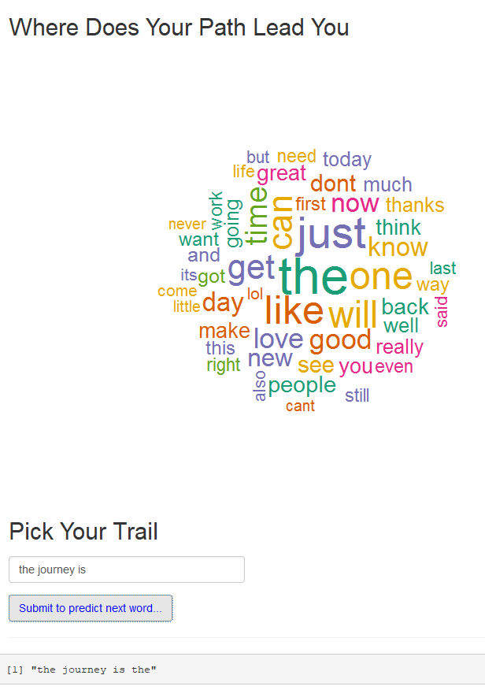

My Capstone End Journey
========================================================
Lovenumbers123 - June 13, 2017

My Path
========================================================

This is the capstone project for the Coursera course at John Hopkins University.  The point of the capstone is to show the ability to explore a new data type, quickly get up to speed on a new application, and implement a useful model in a reasonable period of time.

The purpose of this presentation is to provide an overview of the product developed that highlights
the prediction algorithm  and illustrates an interface that can be utilized by others to predict the next word.

The Data
========================================================

For this project, three files were provided to form the dataset.  The files are as follows:

     *  en_US.blogs.txt
     *  en_US.news.txt
     *  en_US.twitter.txt

This dataset was manipulated, combined, used to create a corpus and split into ngrams to predict the next word.  

Data Exploration and Cleansing
========================================================

The data was transitioned to a clean dataset by performing several functions
such as eliminating the extra Whitespace, removal of numbers, punctuation and 
converting the text to lower case.  

After transitioning the data, the cleaned dataset was tokenized and 
divided into N-gram files.

The files were tested for speed and accuracy by using trial and error methods
until the final project was released.

Additional information and sample code is available at https://github.com/lovenumbers123/Final-Capstone-Projectg.

Your Journey - Find the Next Best Word
========================================================

This application allows you to type in words and it predicts the next word based upon data from either a text, blog or tweet.  

The application can be found by clicking this Shiny link at https://lovenumbers123.shinyapps.io/NextWord/. 

Type "the journey is" to find your journey's next word.

